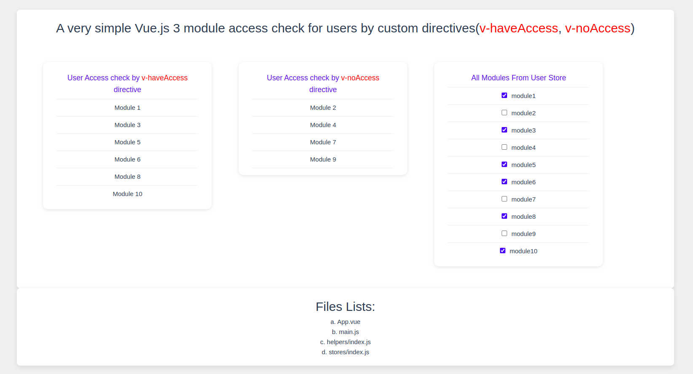

# vue3-module-access-check

A very simple Vue.js 3 module access check for users by custom directives

Demo Link : https://vue3-module-access-check.vercel.app/

Vue3 Custom Directives Document link: https://vuejs.org/guide/reusability/custom-directives

